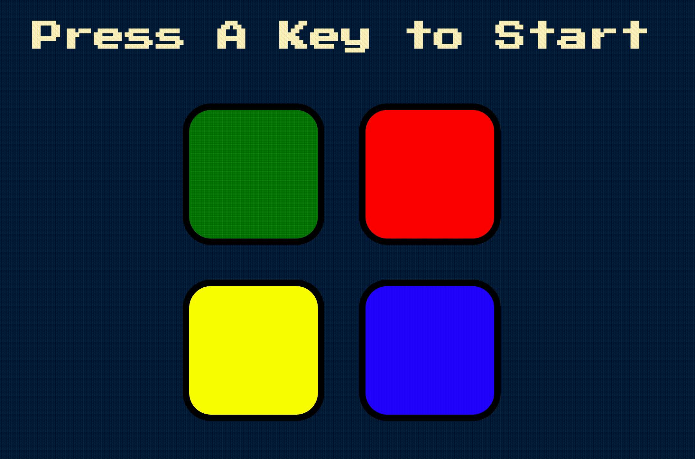

# [Simon Game: DOM Manipulation using Javascript and Jquery](https://jacobgrisham.github.io/DOM-Manipulation-using-Javascript-and-Jquery/)
### Coding challenge from the Udemy Course [the Complete 2020 Web Developer Bootcamp](https://www.udemy.com/course/the-complete-web-development-bootcamp/)
I wrote the code in game.js. The other files were provided by the instructor.

## 💡Lessons Learned
- arrays
- query selectors
- javascript HTML DOM events
- [jQuery effect methods](https://www.w3schools.com/jquery/jquery_ref_effects.asp)
- this keyword
- $ identifier
- creating audio in javascript
- [JavaScript vs. JQUERY](https://www.scaler.com/topics/javascript/javascript-vs-jquery/)

## 🚀 Getting Started
To run this project locally:
- Option 1: With the folder open in your text editor, right click on the index.html and select "Copy Path", and then paste into the browser of your choice
- Option 2: With the folder open in your text editor, right click on the index.html and select "Open with Live Server"

## 🕹 How to Use
- The application will randomly generate an n + 1 sequence of color and audio
- Your goal is to replicate the pattern generated by the application
- [Video Tutorial](https://www.youtube.com/watch?v=1Yqj76Q4jJ4&pbjreload=101)

## 📣 Reference
- Section 15: Boss Level Challenge 2 - The Simon Game of the Udemy Course [the Complete 2020 Web Developer Bootcamp](https://www.udemy.com/course/the-complete-web-development-bootcamp/)
